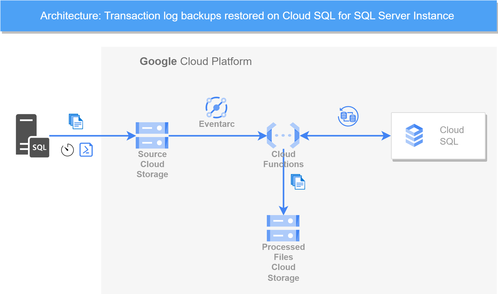

# Restore SQL Server Transaction Log Files to a Cloud SQL for SQL Server instance

This repository contains the implementation of a Python function that restores transaction log backups uploaded to a cloud bucket to a database of an existing Cloud SQL for SQL Server instance.

## Overview

### Restore Capability

You can import transaction log backups in Cloud SQL for SQL Server since [October 2023](https://cloud.google.com/sql/docs/release-notes#October_17_2023). This functionality helps when migrating to Cloud SQL using backups or setting up Cloud SQL for SQL Server DR instances. 

For details, refer to the [official documentation](https://cloud.google.com/sql/docs/sqlserver/import-export/import-export-bak#import_transaction_log_backups).

---

### Main Workflow



The process starts when SQL Server transaction log backup files are uploaded to a cloud bucket. These files may come from a standalone SQL Server instance or another Cloud SQL for SQL Server instance.

The upload event fires an EventArc trigger that calls the Python function. The function gets the path to the log file that was uploaded and constructs the request to restore the uploaded backup file to the Cloud SQL for SQL Server instance.

After the execution of the import request, the function checks periodically the progress of the restore operation. Once the status of the operation changes to "DONE", which means that it has an outcome, the function executes the following:

1. If the operation returns SUCCESS (determined by the absence of the 'error' element in the response JSON), then the function makes a copy of the backup file to the 'processed' storage bucket (if defined) and then finally deletes the file from the source storage bucket, thus signaling that the function processed the file successfully. It then returns an OK, finishing the execution.

2. If the outcome of the operation returns ERROR, then depending on the details of the error response inside, the function implements one of the following decisions:

    - If the import failed with SQL Server error 4326 - too early to apply to the database - then the function assumes that the log file was processed already and deletes it from the bucket. The function returns an OK, finishing the execution.

    - If the import failed with SQL Server error 4305 - too recent to apply to the database - the function assumes that there are some synchronization issues and returns a runtime error. It does not delete the log backup file from the source bucket and it relies on the retry mechanism - the same import is retried later (up to a maximum of 7 days) in a new function execution.
    
    - If the import fails for any other reason or if the function breaks mid-way, the function fails and returns a runtime error, relying on the retry mechanism that schedules a later attempt in a new execution. The file is not deleted from the source bucket.

The function needs certain information to make the proper request to restore the uploaded backup file to the Cloud SQL for SQL Server instance. This information includes:

- The Cloud SQL Instance name
- The database name
- The type of backup (full, differential, or transaction log backup)
- If the backup is restored with recovery or not (leaving the database ready to perform subsequent restores in case of no recovery used)

There are two ways in which the function gets this information: Either from the file name itself or from object metadata. To enable the function to use the file name functionality, set the `USE_FIXED_FILE_NAME_FORMAT` environment variable to "True". In this way, the function expects all the uploaded backup files to have a fixed name pattern from which it infers the needed information. More information below, in the Constraints section. We recommend using the option that is easier for you to implement (either changing backup file names or deciding the logic to persist object metadata).

The function can also restore full and differential backup files. To achieve this functionality, use the two options provided (fixed file name or object metadata to signal to the function that the backups are full, differential, or transaction log backups). In case of fixed file name, make sure that you have the substrings "_full" or "_diff" in the file name to trigger full respectively diff backup restores.

By default, the function restores backups with the norecovery option, leaving the database in a state to expect further sequential restores. Use the "_recovery" substring in the file name or set the Recovery tag to "True" in the object metadata. This is useful when switching to your DR Cloud SQL instance. In such cases, the function must restore a backup file with the recovery option set to true. This triggers the recovery option and leaves the database in an accessible state.

This repository also contains a PowerShell script for regularly uploading new files to cloud storage called `upload-script.ps1`, existing in the scheduled-upload folder. This provides an automated way of uploading the backup files to cloud storage.

The function must have a defined set of environment variables. Details about them are described below, in the constraints section.

---

## Features and Functionality

### Backup Types Supported:
- Full backups
- Differential backups
- Transaction log backups

### Restoration Options:
- **Recovery Mode**: Restores with `_recovery` for accessibility.
- **No Recovery Mode** (default): Leaves the database ready for additional restores.

### Backup Information Source:
1. **File Name Format**:
   - Requires a specific file naming convention to derive metadata such as instance name, database name, backup type, and recovery status.
   - Example pattern: `<instance-name>_<database-name>_<backup-type>_<recovery-status>_*.*`

2. **Object Metadata**:
   - Metadata tags provide necessary information for the function (e.g., `CloudSqlInstance`, `DatabaseName`, `BackupType`, `Recovery`).

---

## Prerequisites

### Tools and Software
- **Cloud Shell** or [gcloud CLI](https://cloud.google.com/sdk/gcloud#download_and_install_the)
- **PowerShell** 5.1 or 7.X
- [Google Cloud PowerShell Module](https://cloud.google.com/tools/powershell/docs/quickstart)

### Permissions Required
For the operations in this section below you need the following permissions:

                cloudsql.instances.get
                cloudsql.instances.list
                storage.buckets.create
                storage.buckets.get
                storage.buckets.getIamPolicy
                storage.buckets.setIamPolicy
                storage.buckets.update
                storage.buckets.list
                iam.roles.create
                iam.roles.delete
                iam.roles.get
                iam.roles.list
                iam.roles.undelete
                iam.roles.update
                iam.serviceAccounts.create
                iam.serviceAccounts.get
                iam.serviceAccounts.list     
                resourcemanager.projects.list
                resourcemanager.projects.get
                resourcemanager.projects.getIamPolicy
                resourcemanager.projects.setIamPolicy

and member of the following predefined roles:
                
                roles/cloudfunctions.developer

or, your user must be member of the following predefined roles:

                roles/cloudsql.editor
                roles/storage.admin
                roles/iam.roleAdmin
                roles/iam.serviceAccountCreator
                roles/resourcemanager.projectIamAdmin
                roles/cloudfunctions.developer

---

## Setup and Configuration

### Cloud Function Deployment

1. **Create a GCS Bucket** for storing transaction log backups:
   ```bash
   export PROJECT_ID=`gcloud config get-value project`

   gcloud storage buckets create gs://<BUCKET_NAME> \
       --location=<BUCKET_LOCATION> \
       --public-access-prevention
   ```

2. **Grant Necessary Permissions**:
   Assign `roles/storage.legacyBucketReader` to the Cloud SQL service account:
   ```bash
   gcloud projects add-iam-policy-binding ${PROJECT_ID} \
       --member="serviceAccount:<service-account-email>" \
       --role="roles/storage.legacyBucketReader"
   ```

3. **Create a Cloud Function Service Account**:
   ```bash
   gcloud iam service-accounts create cloud-function-sql-restore-log \
       --display-name "Service Account for Cloud Function"
   ```

4. **Assign Roles to the Service Account**:
   ```bash
   gcloud iam roles create cloud.sql.importer \
        --project ${PROJECT_ID} \
        --title "Cloud SQL Importer Role" \
        --description "Grant permissions to import and synchronize data from a cloud storage bucket to a Cloud SQL instance" \
        --permissions "cloudsql.instances.get, cloudsql.instances.import, eventarc.events.receiveEvent, storage.buckets.get, storage.objects.create, storage.objects.delete, storage.objects.get"
   ```
5. **Attach the Cloud SQL import role to the Cloud function service account.**:
   ```bash
        gcloud projects add-iam-policy-binding ${PROJECT_ID} \
        --member="serviceAccount:cloud-function-sql-restore-log@${PROJECT_ID}.iam.gserviceaccount.com" \
        --role="projects/${PROJECT_ID}/roles/cloud.sql.importer"
   ```

6. **Deploy the Function**:
- On your local development environment, install and initialize the gcloud CLI.

- Clone the sql server restore cloud function repository.

- Navigate to Function folder

- From the restore-sql-server-transaction-logs/Function folder, run the following gcloud command to deploy the cloud function:
   ```bash
   gcloud functions deploy <YOUR_FUNCTION_NAME> \
        --gen2 \
        --region=<YOUR_REGION> \
        --retry \
        --runtime=python312 \
        --source=. \
        --timeout=540 \
        --entry-point=fn_restore_log \        
        --set-env-vars USE_FIXED_FILE_NAME_FORMAT=False,PROCESSED_BUCKET_NAME=,MAX_OPERATION_FETCH_TIME_SECONDS=30
        --trigger-bucket=<BUCKET_NAME> \
        --service-account cloud-function-sql-restore-log@${PROJECT_ID}.iam.gserviceaccount.com
   ```

7. **Set Invoker Permissions**:
   ```bash
   gcloud functions add-invoker-policy-binding <FUNCTION_NAME> \
       --member="serviceAccount:cloud-function-sql-restore-log@${PROJECT_ID}.iam.gserviceaccount.com"
   ```

---

### On-Premises Windows Server SQL Server: Automate Backup and Upload Script

To schedule a **transaction log backup** on Windows Server 2019 using SQL Server Management Studio (SSMS), follow these steps:

---

### **Step 1: Ensure the Database is in FULL Recovery Model**
Transaction log backups are only possible if the database is in the **FULL** recovery model.

1. Open SSMS and connect to your SQL Server instance.
2. Expand **Databases**, right-click on the target database, and choose **Properties**.
3. In the **Database Properties** window, go to the **Options** page.
4. Under **Recovery Model**, ensure it is set to **FULL**. If not:
   - Change the recovery model to **FULL**.
   - Click **OK** to save the changes.

---

### **Step 2: Create a Transaction Log Backup Script**
1. Right-click the database and select **Tasks** → **Back Up...**.
2. In the **Back Up Database** window:
   - **Backup type**: Choose **Transaction Log**.
   - **Destination**: Add a file destination (e.g., `C:\SQLBackups\YourDatabase_Log.trn`).
3. Click **Script** (at the top of the window) → **Script Action to New Query Window**.
4. Copy the generated script for later use.

Example Script:
```sql
BACKUP LOG [YourDatabase]
TO DISK = N'C:\SQLBackups\YourDatabase_Log.trn'
WITH NOFORMAT, NOINIT,
NAME = N'YourDatabase-Transaction Log Backup',
SKIP, NOREWIND, NOUNLOAD, STATS = 10;
```

---

### **Step 3: Schedule the Transaction Log Backup Using SQL Server Agent**
SQL Server Agent is used to automate backups.

1. **Enable SQL Server Agent**:
   - In SSMS, expand the **SQL Server Agent** node in Object Explorer.
   - If it is not running, right-click and select **Start**.

2. **Create a New Job**:
   - Right-click on **Jobs** under SQL Server Agent and select **New Job**.
   - In the **New Job** window:
     - **Name**: Enter a name (e.g., `Transaction Log Backup`).
     - **Description**: Optionally, add a description.

3. **Add a Step to Perform the Backup**:
   - Go to the **Steps** page and click **New**.
   - In the **New Job Step** window:
     - **Step name**: Enter a name (e.g., `Backup Transaction Log`).
     - **Type**: Select **Transact-SQL script (T-SQL)**.
     - **Database**: Select your target database.
     - **Command**: Paste the transaction log backup script created earlier.
   - Click **OK** to save the step.

4. **Set a Schedule for the Job**:
   - Go to the **Schedules** page and click **New**.
   - In the **New Job Schedule** window:
     - **Name**: Enter a schedule name (e.g., `Every 15 Minutes`).
     - **Schedule Type**: Select **Recurring**.
     - **Frequency**: Set the frequency (e.g., **Daily**).
     - **Daily Frequency**: Set the interval (e.g., every **15 minutes**).
     - **Duration**: Specify the start and end dates.
   - Click **OK** to save the schedule.

5. **Enable Alerts (Optional)**:
   - Go to the **Notifications** page and set up alerts if the job fails.

6. Click **OK** to save the job.

---

### **Step 4: Configure the PowerShell Script for Backup Upload**

For the operations in this section below you need the following permissions:

                iam.serviceAccounts.create
                iam.serviceAccounts.get
                iam.serviceAccounts.list
                iam.serviceAccountKeys.create
                iam.serviceAccountKeys.delete
                iam.serviceAccountKeys.disable
                iam.serviceAccountKeys.enable
                iam.serviceAccountKeys.get
                iam.serviceAccountKeys.list
                resourcemanager.projects.get
                resourcemanager.projects.list
                resourcemanager.projects.getIamPolicy
                resourcemanager.projects.setIamPolicy

or, your user must be member of the following predefined roles:

                roles/iam.serviceAccountCreator
                roles/iam.serviceAccountKeyAdmin
                roles/resourcemanager.projectIamAdmin                

Powershell is the language of choice for the upload script because many SQL Server Database Administrators (DBAs) leverage PowerShell as a valuable tool to streamline and automate their tasks and efficiently manage database environments. PowerShell runs on Windows, Linux, and macOS.

The powershell upload script runs in Powershell 5.1.X. or Powershell 7.X 
You need to install the [GoogleCloud powershell module](https://cloud.google.com/tools/powershell/docs/quickstart).

To set up the automatic file upload script, you need to perform some operations in your cloud project. In the [Cloud shell](https://cloud.google.com/shell/docs/using-cloud-shell) execute the following commands:

1. First, create a service account that has rights to upload to the bucket:

        gcloud iam service-accounts create tx-log-backup-writer \
        --description="Account that writes transaction log backups to GCS" \
        --display-name="tx-log-backup-writer"

1. Grant rights on the service account to view, create and overwrite objects on the bucket:
        
        export PROJECT_ID=`gcloud config get-value project`

        gcloud storage buckets add-iam-policy-binding gs://<BUCKET_NAME> --member=serviceAccount:tx-log-backup-writer@${PROJECT_ID}.iam.gserviceaccount.com --role=roles/storage.objectAdmin

1. Create a private key for your service account. You need to store the private key file locally to be authorized to upload files to the bucket.

        gcloud iam service-accounts keys create KEY_FILE \
        --iam-account=tx-log-backup-writer@${PROJECT_ID}.iam.gserviceaccount.com

1. Create a folder on a machine with access to the backup files. Copy the contents of the scheduled-upload folder from the repository in the newly created location. Copy the key file from the previous step in the same folder as the upload-script.ps1 file.


Update constants in the `upload-script.ps1` file with the bucket name, key file path, and other details.

Provide in the -Value parameter the full path to the folder where your backup files will be generated:

        New-Variable -Name LocalPathForBackupFiles -Value "" -Option Constant

Provide in the -Value parameter the name of the bucket where you want the backup files to be uploaded:

        New-Variable -Name BucketName -Value "" -Option Constant

Provide in the -Value parameter the full path to the key file that you generated earlier and saved locally on the machine where the script runs:

        New-Variable -Name GoogleAccountKeyFile -Value "" -Option Constant

 Provide in the -Value parameter the name of the CloudSqlInstance. Optional. Alternativelly, it can be inferred from the name of the files:

        New-Variable -Name CloudSqlInstanceName -Value "" -Option Constant
---

### **Step 5: Create a Scheduled Task for Regular Uploads**
Create a scheduled task so that the script is called regularly. For example, the scheduled task below starts execution at 2:45 PM and runs every minute. Replace `<username>` with a local user account with privileges to read and edit the settings.json file on your machine.

```bash
schtasks /create /sc minute /mo 1 /tn "Cloud Storage Upload script" /tr "powershell <full-path-to-the-upload-script>" /st 14:45 /ru <local_account_username> /rp
```

**Note**: You will be prompted to provide the password for the local `<local_account_username>` when you create the task.

---

### **Step 6: Test the Backup Job**
1. In **SQL Server Agent**, locate the job you just created.
2. Right-click the job and select **Start Job at Step...**.
3. Verify the transaction log backup file is created at the specified location.

---

### **Step 7: Verify Scheduled Backups and Uploads**
1. **Check the SQL Server Agent Job History**:
   - In **SQL Server Agent**, right-click the job and select **View History**.
   - Ensure the job runs successfully at the scheduled intervals.

2. **Verify Backup File Uploads**:
   - Check the destination folder (e.g., `C:\SQLBackups`) to confirm that transaction log files are being generated.
   - Verify that the backup files are being uploaded to the GCS bucket according to the scheduled task.

---

### Additional Tips:
- Ensure sufficient disk space for transaction log backups.
- Periodically validate backups by restoring them to a test environment.
- Combine transaction log backups with regular **full backups** for a complete backup strategy.

---

## Testing

### Cloud Function Tests
The Function folder contains a unit tests file called `main_test.py`. The unit tests are using the pytest framework. Install [Pytest](https://pypi.org/project/pytest/) by running:
```bash
pip install pytest
```

To run the unit tests for the cloud function, run:
```bash
pytest
```

### Upload Script Tests
The `scheduled-upload` folder contains a unit tests file called `upload-script.Tests.ps1`. Make sure that you have [Pester](https://pester.dev/docs/quick-start) installed. If not, you can install it by running:
```powershell
Install-Module -Name Pester -Force -SkipPublisherCheck
```

To run the unit tests, either execute the script or run the `Invoke-Pester` command in the folder where the `upload-script.Tests.ps1` file exists.

---

## References
- [Eventarc triggers](https://cloud.google.com/functions/docs/calling/eventarc)
- [Deploy a Cloud Function](https://cloud.google.com/functions/docs/deploy)
- [Import data from a BAK file to Cloud SQL for SQL Server](https://cloud.google.com/sql/docs/sqlserver/import-export/import-export-bak#import_data_from_a_bak_file_to)
- [Recovery and the transaction log](https://learn.microsoft.com/en-us/sql/relational-databases/backup-restore/restore-and-recovery-overview-sql-server?view=sql-server-ver16#TlogAndRecovery)

